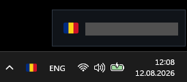
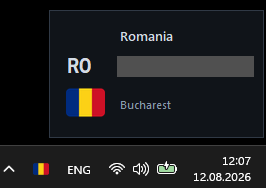
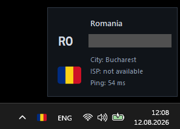
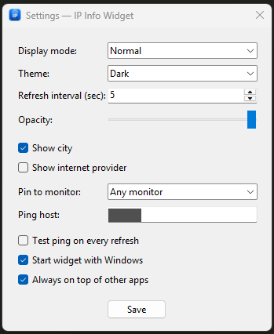
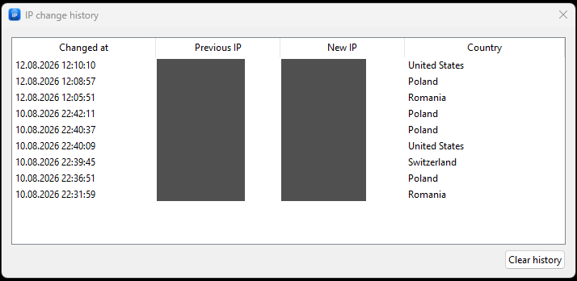

# IP Info Widget

**Your public IP and network location, visible on your Windows desktop.**

IP Info Widget is a lightweight desktop widget for checking your current public
exit address, country and city. Switching VPN locations? See whether the address
and country changed without opening a browser.


**Version 1.5.1 is being prepared.** Release binaries are not yet published.
Public IP addresses are redacted in the screenshots below; the interface is unchanged.

## Key features

- **IP and location:** public IP, country, ISO country code, bundled country flag,
  city and optional internet provider.
- **Refresh and history:** automatic refresh (5 seconds by default, minimum 5),
  manual refresh, the latest 50 observed IP changes stored locally, and Windows
  notifications when available. The first successful lookup establishes the baseline.
- **Optional ping:** test a chosen host manually or after each successful IP lookup.
- **Three layouts:** Compact, Normal and Monitoring; Dark/Light themes, 55–100%
  opacity and configurable always-on-top.
- **Desktop placement:** dragging, monitor pinning, off-screen recovery and support
  for valid negative multi-monitor coordinates.
- **Windows integration:** country flags in the notification tray/taskbar, autostart,
  portable mode and an About dialog.

The widget reports the public information returned by the IP service. It does
not determine whether a VPN is connected or whether a connection is leak-free.

## Display modes

| Compact | Normal | Monitoring |
| --- | --- | --- |
|  |  |  |
| Flag and IP. | Country, ISO code, flag, IP and optional city/provider. | Country, ISO code, flag, IP, city/provider rows and ping result when tested. |

Choose a mode in **Settings → Display mode**. Monitoring respects the city/provider
visibility settings; hidden or missing values display as “not available.” A refresh
without ping displays “Ping: not tested.” Taskbar icon updates are best effort
because Windows may cache pinned shortcut icons.

## Settings and history

Use the widget's right-click menu to open Settings or IP change history.



Configure appearance, refresh interval, ping target, autostart and monitor pinning.
At startup a configured monitor takes priority over saved coordinates. If that
monitor is missing, placement falls back to primary while retaining the pin.
Unpinned positions are restored when sufficiently visible, otherwise repaired.



History records the previous and new IP, country and timestamp. **Clear history**
removes the local entries. Changes are detected between successful lookups within
the current run; short-lived changes between checks may not be observed.

## Installation

The planned installer is **`IPInfoWidget-Setup-1.5.1.exe`**. Once published on
[GitHub Releases](https://github.com/STYL15HH1/ip-info-widget/releases), run it to
install under Program Files. Administrator permission is required; a desktop
shortcut is optional. End users do not need Python.

The standalone **`IPInfoWidget-1.5.1.exe`** may also be offered as a release asset.
Without `--portable`, it uses the same per-user storage as an installed copy.
Neither 1.5.1 binary is available as part of this preparation step.

## Portable mode

Run a standalone copy from a writable folder:

```powershell
.\IPInfoWidget-1.5.1.exe --portable
```

| Mode | Settings | History |
| --- | --- | --- |
| Normal / installed | `%LOCALAPPDATA%\MyIPWidget\settings.json` | `%LOCALAPPDATA%\MyIPWidget\ip-history.json` |
| Portable | `<application folder>\config\settings.json` | `<application folder>\history\ip-history.json` |

Portable mode disables the autostart preference and its Settings control. It does
not remove an existing Windows startup entry created by a normal-mode copy.

## Usage

- **Copy:** click the displayed IP.
- **Move:** drag the widget; a configured monitor pin constrains dragging.
- **Right-click the widget:** refresh, test connection, hide, open History,
  Settings or About, or quit.
- **Tray menu:** show, hide, refresh, restore to primary, or quit.
- **Recover:** select **Restore widget to primary monitor** in the tray. This
  reveals the widget, moves it safely to primary, clears its monitor pin and saves
  the new position. Always-on-top is preserved and recovery survives restart.
  Choose a monitor again in Settings to re-enable pinning.

## Privacy

Public IP and approximate geolocation are retrieved from **[ipwho.is](https://ipwho.is/)**
over HTTPS. Country flags are bundled locally. Optional ping contacts the host you
configure. Settings and IP-change history are stored locally, and the application
requires no account. Public IPs and History timestamps can reveal connection
information when you share screenshots or history files.

## Platform and building from source

The application targets **Windows**; the installer targets **x64-compatible Windows**.
The source uses Python 3.11+ and Tkinter. The verified build environment used
**64-bit Python 3.11.9 with Tcl/Tk 8.6**. The build script explicitly references
Tcl/Tk 8.6 filenames and paths; compatibility with other Python/Tk distributions
must be checked before building.

To run from source with a standard Python installation including Tkinter:

```powershell
py -m pip install -r requirements.txt
py app.py
# Optional: py app.py --portable
```

To build, install Inno Setup (version 6 is discovered in standard install paths;
other installations must expose `ISCC.exe` on PATH), then run:

```powershell
.\build_exe.bat
```

The script selects `py` or `python`, installs dependencies and PyInstaller, reads
`core/version.py`, and creates:

```text
dist/IPInfoWidget-1.5.1.exe
installer/IPInfoWidget-Setup-1.5.1.exe
```

The one-file, windowed EXE bundles Tcl/Tk, all 252 country flags, the application
icon and the author image. If Inno Setup cannot be found, the EXE stage can finish
but the script reports failure before creating the installer.

Run the positioning regression suite on Windows with Tkinter available:

```powershell
py -B -m unittest discover -s tests -v
```

## Project structure

```text
app.py              Application bootstrap
core/               Models, IP/ping services, settings, storage and history
ui/                 Tk widget, layouts and dialogs
windows/            Monitor, tray, taskbar, notification and autostart adapters
assets/             Application icon, author image and country flags
docs/               Architecture and screenshots
tests/              Positioning regression tests
build_exe.bat       PyInstaller and installer build
installer.iss       Inno Setup configuration
```

See [Architecture](docs/ARCHITECTURE.md) and [Changelog](CHANGELOG.md).
The 1.5.0 handover PDF and older project documentation are historical snapshots;
current source and architecture documentation take precedence.

## License and author

[MIT License](LICENSE). Created by **[STYL15HH1](https://github.com/STYL15HH1)**.

[GitHub repository](https://github.com/STYL15HH1/ip-info-widget)
