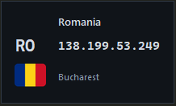
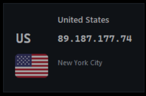
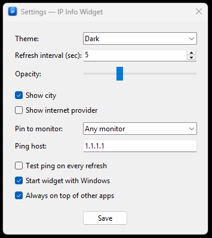
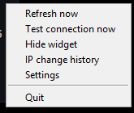

# IP Info Widget

**IP Info Widget** is a compact Windows utility that continuously shows the
public IP address currently visible on the internet, together with its country,
city, and optional provider. It is designed especially for VPN users: switch a
server and immediately see the new public exit address, country flag, and IP
change history without opening a browser.

The application uses the HTTPS API at [ipwho.is](https://ipwho.is/) for public
IP and approximate location data. Country flags are bundled locally, so no flag
images are downloaded while the widget is running.

## Screenshots

| Widget and country flags | Controls and history |
| --- | --- |
|    |   |

## What it does

- Shows the current public IP, country, ISO country code, local country flag,
  city, and optional internet provider.
- Refreshes automatically every 5 seconds by default; the interval can be set
  from 5 seconds to 24 hours.
- Detects every public-IP change, keeps the last 50 changes locally, and can
  send a Windows notification when an address changes.
- Updates the window, taskbar, and notification-area icon to the flag of the
  current country after a successful lookup.
- Lets you copy the visible IP with one click.
- Includes a manual refresh and an optional Windows ping check for a host of
  your choice.
- Runs quietly in the notification area; its menu can show/hide the widget,
  refresh data, test connectivity, open history/settings/About, or quit.

## Display modes

Choose a layout in **Settings → Display mode**. Changing it is immediate and
keeps your theme, opacity, position, and monitor selection.

| Mode | Best for | Information shown |
| --- | --- | --- |
| **Compact** | Minimal desktop use | Flag and public IP only. |
| **Normal** | Everyday VPN checks | Country, ISO code, flag, IP, and optional city/provider. |
| **Monitoring** | Persistent connection monitoring | Normal information plus city, provider, and the actual result of the latest ping test. |

Monitoring mode intentionally does **not** claim unsupported VPN, IPv6, or DNS
status. It only displays information the application has actually retrieved.

## Settings

| Option | Description |
| --- | --- |
| **Display mode** | Switch between Compact, Normal, and Monitoring. |
| **Theme** | Use the Dark or Light interface. |
| **Refresh interval** | Choose how frequently the public IP is checked. |
| **Opacity** | Set widget transparency from 55% to 100%. |
| **Show city** | Show or hide the detected city. |
| **Show internet provider** | Show or hide the ISP returned by the IP service. |
| **Pin to monitor** | Keep the widget in the work area of a selected display. |
| **Ping host** | Set the host used by the connectivity test; `1.1.1.1` is the default. |
| **Test ping on every refresh** | Automatically run the selected ping with every data update. |
| **Start widget with Windows** | Start automatically after signing in to Windows. |
| **Always on top** | Keep the widget above other windows, or allow it to be covered normally. |

Saved positions and layout changes are checked against current monitor work areas.
At least 50 horizontal and 30 vertical pixels must remain visible on one display
(or the full dimension for a smaller widget). Valid negative coordinates are
preserved; off-screen positions are moved safely to the primary monitor and only
the repaired coordinates are saved when unpinned. At startup, a configured monitor
pin takes priority over saved coordinates. If that display is missing, placement
falls back safely to primary while retaining the pin for when the display returns.

Use **Restore widget to primary monitor** in the tray menu to recover a hidden or
off-screen widget. This clears the monitor pin and saves the primary position,
so recovery survives restart and the widget stays unpinned until you select a
monitor again in Settings. Always-on-top is preserved. If no primary monitor can
be discovered, the pin and coordinates are retained instead of saving a guessed
position.

The widget can be dragged to any position. Its position, appearance, display
mode, refresh preferences, and history are saved automatically.

## IP history and notifications

When the public address changes, the program records the old IP, new IP,
country, and local timestamp. Open **IP change history** from the right-click
menu to review the latest 50 events or clear the history. Windows toast
notifications are sent when supported by the system.

## Country icon behavior

At startup the app uses its regular blue IP Info Widget icon. Once a lookup
succeeds, the flag for the detected country becomes the icon associated with the
running widget in the Windows taskbar and notification area. If the lookup fails
the last valid flag remains; if a local flag asset is unavailable, the standard
application icon is used as a safe fallback.

Windows may cache icons for old pinned shortcuts. If a pinned icon does not
refresh, unpin the old shortcut and start the new executable again.

## About

The **About** item in the widget menu opens a themed dialog with the current
version, author attribution for [STYL15HH1](https://github.com/STYL15HH1), a
link to this repository, and MIT license information.

## Portable mode

The standard installed application stores settings and history under:

```text
%LOCALAPPDATA%\MyIPWidget
```

For a self-contained copy, run the executable with `--portable`:

```text
IPInfoWidget-1.5.0.exe --portable
```

It creates data beside the executable instead:

```text
IP Info Widget/
├── IPInfoWidget-1.5.0.exe
├── config/settings.json
└── history/ip-history.json
```

Autostart is deliberately disabled in portable mode because a removable drive
letter can change.

## Download and run

Download the versioned executable from the project's GitHub Releases page. No
Python installation is required. Run the EXE directly, or add `--portable` for
self-contained configuration and history.

## Run from source

1. Install Python 3.11 or newer for Windows and enable **Add Python to PATH**.
2. Open a terminal in this folder.
3. Run `python -m pip install -r requirements.txt`.
4. Run `python app.py` or `python app.py --portable`.

## Build

Install [Inno Setup](https://jrsoftware.org/isdl.php), then run `build_exe.bat`.
The script reads the version from `core/version.py`, creates a versioned
standalone EXE such as `dist/IPInfoWidget-1.5.0.exe`, and then creates the
matching installer `installer/IPInfoWidget-Setup-1.5.0.exe`.

The build includes the application icon, author avatar, all 252 bundled country
flags, and the Tcl/Tk runtime required by the standalone Windows executable.

## Privacy

To determine your public IP and approximate location, the app contacts
`https://ipwho.is/`. Locally it stores only its settings and up to 50 IP-change
entries. The history can be cleared at any time from the application menu.

## License

This project is released under the [MIT License](LICENSE).

## Development

See [Architecture](docs/ARCHITECTURE.md) for the modular design, storage model,
Windows integration, and extension points.
