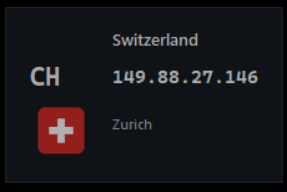

# IP Info Widget

IP Info Widget is a lightweight Windows desktop widget that keeps your current public IP address and approximate connection location visible at a glance. It is especially useful when you frequently switch VPN servers and want a simple, persistent confirmation that your public IP and exit location have actually changed.

The widget refreshes in the background every five seconds by default. When your public IP changes, it records the change and can show a Windows notification, making it easy to spot a successful VPN reconnection or an unexpected change in your public route.

## Screenshots

| VPN exit locations | Widget controls |
| --- | --- |
|   |  |
|   |  |

## Features

- Retrieves public-IP and location data securely over HTTPS.
- Shows the public IP address, country, ISO country code, city, and a local country flag without downloading flag images at runtime.
- Monitors for IP changes every 5 seconds by default, with a configurable refresh interval from 5 seconds to 24 hours.
- Saves up to 50 IP changes with the old and new address, country, and timestamp; the history is available from the right-click menu.
- Shows a Windows notification when the public IP changes.
- Copies the current IP address to the clipboard with one click.
- Keeps the widget above other applications when desired—ideal for VPN monitoring—or lets it behave like a regular window.
- Supports light and dark themes, adjustable opacity, and remembers the widget position.
- Can be pinned to a specific monitor in a multi-display workspace.
- Includes an optional ping test for a chosen host, available on every refresh or on demand from the menu.
- Can start automatically when you sign in to Windows.
- Provides a compact right-click menu for refresh, connection testing, hiding the widget, viewing history, opening settings, and quitting.

## Settings

| Option | Description |
| --- | --- |
| **Theme** | Select the Dark or Light appearance. |
| **Refresh interval (sec)** | Choose how often the public IP data is checked. The minimum is 5 seconds. |
| **Opacity** | Adjust widget transparency from 55% to 100%. |
| **Show city** | Display the detected city beneath the IP address. |
| **Show internet provider** | Display the ISP reported by the IP lookup service. |
| **Pin to monitor** | Keep the widget on a selected display in a multi-monitor setup. |
| **Ping host** | Set the host used for the optional connectivity test; `1.1.1.1` is the default. |
| **Test ping on every refresh** | Run the selected ping check whenever the widget updates. |
| **Start widget with Windows** | Launch the widget automatically after you sign in to Windows. |
| **Always on top of other apps** | Keep the widget visible above other windows, or turn it off when you prefer it to be covered normally. |

## Run from source

1. Install Python 3.11 or later for Windows and enable **Add Python to PATH**.
2. Open a terminal in this folder.
3. Run `python -m pip install -r requirements.txt`.
4. Run `python app.py`.

The packages are needed only for system-tray support.

## Flags

The `assets/images/flags` folder contains 252 PNG flag images. The application selects a local file using the country code returned by the API, for example `PL.png` for Poland, without downloading flag images from the internet.

## Build the installer

Install the free [Inno Setup](https://jrsoftware.org/isdl.php) once, then double-click `build_exe.bat` in this folder. The script will:

1. install PyInstaller and required packages on your development computer;
2. include the flag and icon assets;
3. create a standalone `dist/IPInfoWidget.exe`;
4. build `installer/IPInfoWidget-Setup-1.4.1.exe`.

Share `IPInfoWidget-Setup-1.4.1.exe` with end users. They do not need Python or any packages installed. The installer requires UAC confirmation, installs the application in `C:\Program Files\IP Info Widget`, and can create a desktop shortcut.

## Privacy

To obtain the public address and approximate location, the application calls `https://ipwho.is/`. Locally, it stores only appearance and position settings plus up to 50 IP change history records. The history can be cleared from the **IP change history** window.
